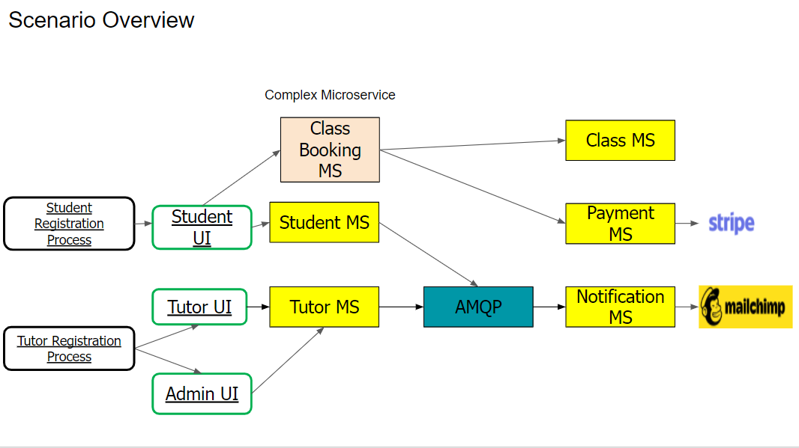

## Digitalize Tuition Records

# Business Scenario
Tuition centres in Singapore rely on tedious manual processes to enrol students, schedule classes, distribute workload among tutors and collect payment. This often leads to a loss in revenue due to the extra manpower required to carry out these processes. 

Furthermore, tutors often lack the ability to choose their preferred class schedules and lack flexibility in deciding on their preferred workload, leading to unhappiness among tutors and a barrier to entry for many aspiring tutors.

# Solution 
We aim to digitally transform the traditional tuition centres, eliminating the majority of manual work required from both parties by streamlining and automating majority of the processes. 

Additionally, we would also provide the ability and flexibility for tutors to decide on their own schedule and workload easily, within the constraints of their contract. Thereby, making it more appealing to both new and existing tutors.

This will be done via a UX-first approach, through the use of our web application that can be easily accessed and utilized by all stakeholders. Furthermore, it will be deployable for any tuition centre as their enterprise solution.

   
# Database connections on RDS
- Database_connection URL = studentdb2.cw0jtpvjeb4t.us-east-1.rds.amazonaws.com 
- Port Number = 3306 
- Hostname = admin 
- Password = thisismypw

# Mailchimp (use postman to send requests):
1. select authorization
2. enter username and password
  - Username: jenniferwxe
  - Password: 149218c56ba8c2f24e05f157add74e6b-us14

# Stateless Architecture (Token-Based Authentication)
Token-based authentication is stateless. The server does not keep a record of which users are logged in or which JWTs have been issued. Instead, every request to the server is accompanied by a token which the server uses to verify the authenticity of the request. The token is generally sent as an addition Authorization header in form of Bearer {JWT}, but can additionally be sent in the body of a POST request or even as a query parameter. Let's see how this flow works:

    1- User enters their login credentials
    2- Server verifies the credentials are correct and returns a signed token
    3- This token is stored client-side, most commonly in local storage - but can be stored in session storage
    or acookie as well
    4- Subsequent requests to the server include this token as an additional Authorization header or through
    one of the other methods mentioned above
    5- The server decodes the JWT and if the token is valid processes the request
    6- Once a user logs out, the token is destroyed client-side, no interaction with the server is necessary.

   ## Stateless advantages:

**1.Reduces memory usage** - Token instead of sessions. Imagine if a company stored session information of their users.

**2.Reduce session expiration issues** - Expiring sessions can cause issues that are hard to find. Token based applications don't have this problem.

**3.Url Linkability** Some sites store the ID of what the user is looking at in the sessions. This makes it impossible for users to simply copy and paste the URL or send it to friends.

# Technologies and features
- [x] Python & Flask & MySQL Database
- [x] Stripe Subscriptions (Create, Cancel, Reactivate, Update supported)
- [x] HTML theme 
- [x] Docker: Fully split into microservices. Runs with Docker Compose, but can **[easily be translated to Kubernetes](https://kubernetes.io/docs/tasks/configure-pod-container/translate-compose-kubernetes/)**
- [x] User sign up and login (Email Address)
- [x] Notifications for users (Student, Tutor and Admin)

# How To Run The Application
You should make sure that your database is running first and foremost, else the following will fail. Look under installation for Windows or Mac/Linux for how to run the database locally. It just needs to be running in the background, all the databases and tables are created programmatically.

1. Run `docker-compose build` for your first build and when you have made changes.
2. Run `docker-compose up` to run all the services.

Scaling is made easy with `docker-compose.yml` file.

# Microservices
| Simple | Ports |
| ------ | ------ |
| studentMS | 5001 |
| tutorMS | 5002 |
| classScheduleMS | 5004 |
| adminMS | 5008 |
| NotificationMS | 5009 |

| Complex | Ports |
| ------ | ------ |
| registerClassMS | 5003 |
| showClassesMS | 5005 |
| manageTutorsMS | 5006 |
| manageClassesMS | 5007 |

# Error Codes
401 = Unauthorised token/credentials